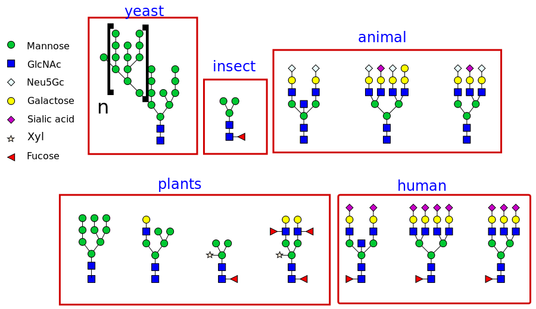

# gly

N-linked glycosylation software

  
  

  Varieties of glycosylation patterns --
  Image by Dna 621 - Own work, CC BY-SA 3.0, https://commons.wikimedia.org/w/index.php?curid=31825161

Many protein based pharmaceuticals are pegylated. The purpose of pegylation is to influence how long a molecule stays in circulation which is its clearance time, and to influence its immunogenicity. The influence on immunogenicity is rarely perfect. In the case of peg-asparaginase, which is a treatment for some kinds of leukemia, there is a 10-20% chance of an allergic reaction despite the pegylation (DOI 10.1002/pbc.25319). This software was made to facilitate the exploration of the notion of whether or not PEG can be replaced with a designed glycan coat to reduce the immunogenicity of theraputic molecules while at the same time providing adaquate control of their clearance time. This could lead to higher quality pharmaceuticals that are cheaper and easier to produce.

The algorithm implements a simple heuristic. If we want to mutate a protein residue, as long as the mutation doesn't disturb the molecule's hydrophobic core, and the mutation is to a hydrophilic residue, there is a good chance the mutation will be successful. The N-linked glycosylation "sequon" which is the attachment point for a glycan, involves pairs of hydrophilic residues in the mutant. So the algorithm looks for pairs of residues that have solvent exposed sidechains as potential mutation sites. Prolines are known to be "deal killers" for N-linked glycosylation, so prolines or other unknown residues in the neighborhood of a potential glycosylation site causes that mutation candidate to be excluded.

The program takes PDB files as inputs. There is a file with the complete structure, a file with solvent exposed atoms, a file with beta sheet residues and a file with alpha helix residues. I am currently using the pymol plugin findSurfaceResidues to get the solvent exposed atoms and pymol itself to get the secondary structure files.

