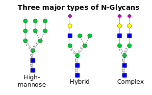

# gly

N-linked glycosylation software

  

Many protein based drugs are pegylated. The purpose of pegylation is to influence how long the drug stays in circulation and to influence its immunogenicity. The influence on immunogenicity is rarely perfect. In the case of peg-asparaginase, which is a treatment for leukemia, there is a 10-20% chance of an allergic reaction despite the pegylation. This software was made to facilitate the exploration of the notion of whether or not PEG can be replaced with a designed glycan coat to reduce immunogenicity of a drug molecule while at the same time providing adaquate control of a drug's clearance time.

The algorithm implements a simple heuristic. If we want to mutate a residue, as long as the mutation doesn't disturb the molecule's hydrophobic core, which may be seen by the solvent accessibility of the mutated residue, and the mutation is to a hydrophilic residue, there is a good chance the mutation will be successful. In other words there is a good chance that the protein will still fold. The N-linked glycosylation "sequon" involves pairs of hydrophilic residues in the mutant. This is not too surprising since one wants glycans pointing into solution. Glycans are hydrophilic so there is a good chance that hanging a glycan onto a protein where a solvent exposed residue used to be may be OK. Since N-linked glycosylation requires pairs of residues to be mutated, the algorithm looks for solvent accessible pairs of residues as potential mutation sites. Prolines are known to be "deal killers" for N-linked glycosylation so prolines or other unknown residues in the neighborhood of a potential glycosylation site causes that mutation candidate to be excluded.

The program takes PDB files as inputs. There is a file with the complete structure, a file with solvent exposed atoms, a file with beta sheet residues and a file with alpha helix residues. I am currently using the pymol plugin findSurfaceResidues to get the solvent exposed atoms and pymol itself to get the secondary structure files.

